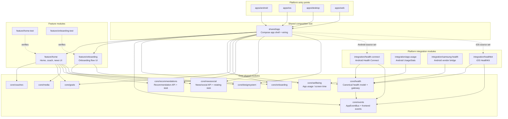
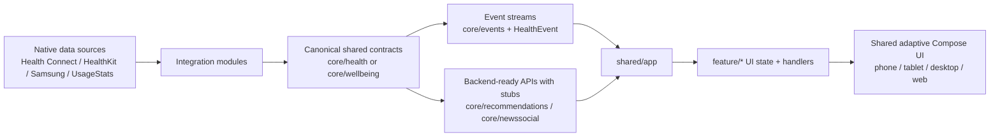

# Architecture Overview

This document shows how the project is wired across platforms, shared modules, integrations, and cross-module patterns.

## High-level structure

## Integration and data patterns

## What each layer owns

- `apps/*` boot the platform and stay thin.
- `shared/app` is the composition root and decides which integrations are wired per platform source set.
- `feature/*` owns UI state, screen composition, and user interactions.
- `core/*` owns reusable contracts, canonical models, event contracts, and deterministic stub APIs.
- `integration/*` adapts platform SDKs and vendor APIs into shared core contracts.

## Current integration map

- Android health data enters through `integration/health-connect`.
- iOS health data enters through `integration/healthkit`.
- Android screen time / app usage enters through `integration/app-usage`.
- Samsung Health is prepared as an Android-only vendor bridge in `integration/samsung-health`.
- Recommendation-of-the-day and daily insights are provided through `core/recommendations`.
- News, social, gallery, and video feed content is provided through `core/newssocial`.

## Patterns used in this repository

- Shared-first Kotlin Multiplatform code in `commonMain`.
- One-way dependency flow: `apps -> shared -> feature -> core`.
- Platform APIs hidden behind integration modules and shared contracts.
- Canonical health model in `core/health` so feature code never depends on raw provider records.
- Event-based module communication via `core/events` and `HealthEvent`.
- Backend-ready API boundaries with stub implementations for features that are not backed by a live service yet.
- One adaptive Compose UI path instead of separate per-device screens.

## Reader guidance

- Read [README.md](/Users/kees/data/projects/personal-health/README.md) for the module inventory.
- Read [docs/kmp-compose-best-practices.md](/Users/kees/data/projects/personal-health/docs/kmp-compose-best-practices.md) for architectural rules and adaptive UI constraints.
- Read [docs/health-integrations.md](/Users/kees/data/projects/personal-health/docs/health-integrations.md) for the detailed health ingestion and event model.
